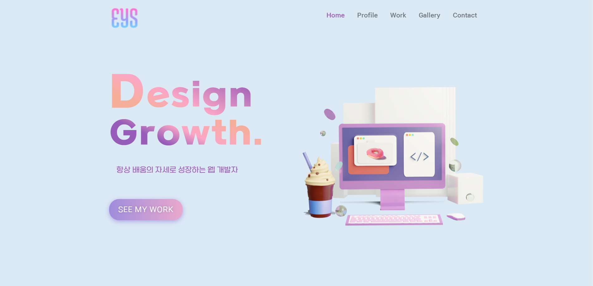
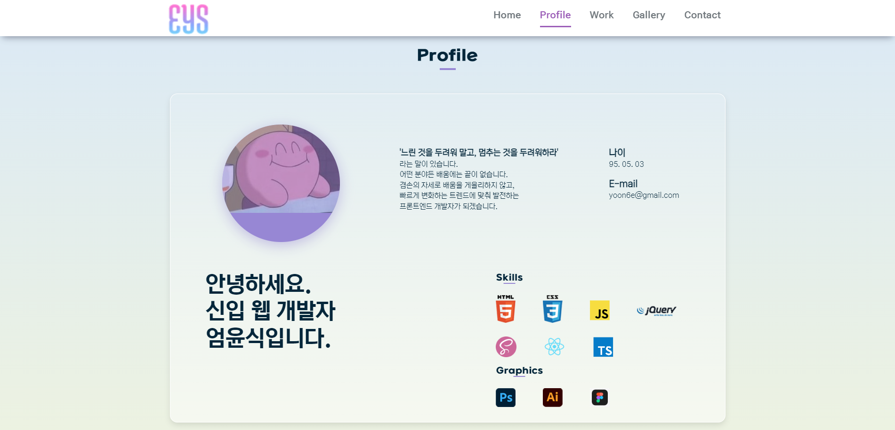
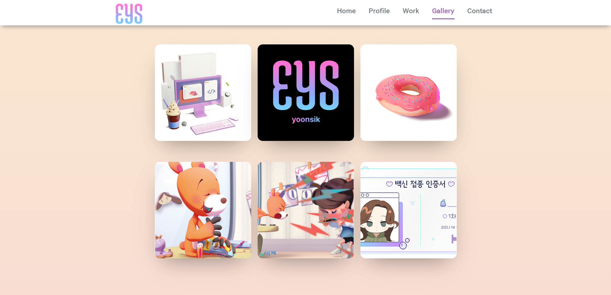
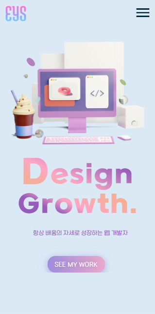

# Portfolio Page
보러가기
https://eomzic.github.io/portfolio_page/
 ## 이미지
 데스크탑
 
 

 모바일

 

## 소개
**안녕하세요. 신입 웹 개발자 엄윤식입니다.**

>*'느린 것을 두려워 말고, 멈추는 것을 두려워하라'*

 라는 고사성어가 있습니다.
어떤 분야든 배움에는 끝이 없습니다.
겸손의 자세로 배움을 게을리 하지 않고 빠르게 변화하는 트렌드에 맞춰 발전하는 프론트엔드 개발자가 되겠습니다.

💌메일 : yoon6e@gmail.com

## 포트폴리오 페이지에 사용한 기술
### JavaScript ES6
순수 JavaScript로 프로그램 작성
### SCSS
섹션별로 파일을 나눠 작성했으며, main.scss에 임포트한 후 CSS로 컴파일

## 포트폴리오 페이지의 기능 설명
### 스크롤 위치에 따라 marker가 움직이는 내비게이션

현재 스크롤이 있는 섹션에 해당하는 메뉴로 marker가 이동합니다.

### 이미지를 클릭하면 나오는 팝업 슬라이드

* 갤러리의 썸네일을 클릭하면 썸네일에 걸려있는 원본 이미지 링크들을 팝업창에 띄움
* 원본 이미지의 수만큼 슬라이드 밑에 버튼(bullet)들이 생성되고 몇번째 이미지인지 표시됨
* 슬라이드 밑 버튼을 클릭하면 해당 번호의 이미지로 슬라이딩됨
* 이전, 다음 슬라이드로 넘어가는 버튼
* 무한 슬라이드
  

## 반응형 웹페이지
PC, tablet, mobile 해상도에 따라 보이도록 미디어 쿼리를 작성했습니다.
